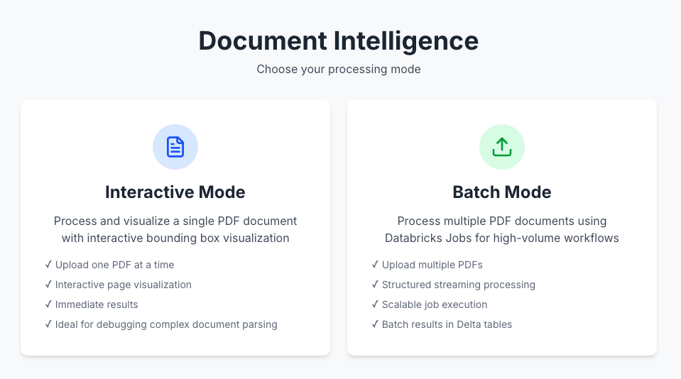
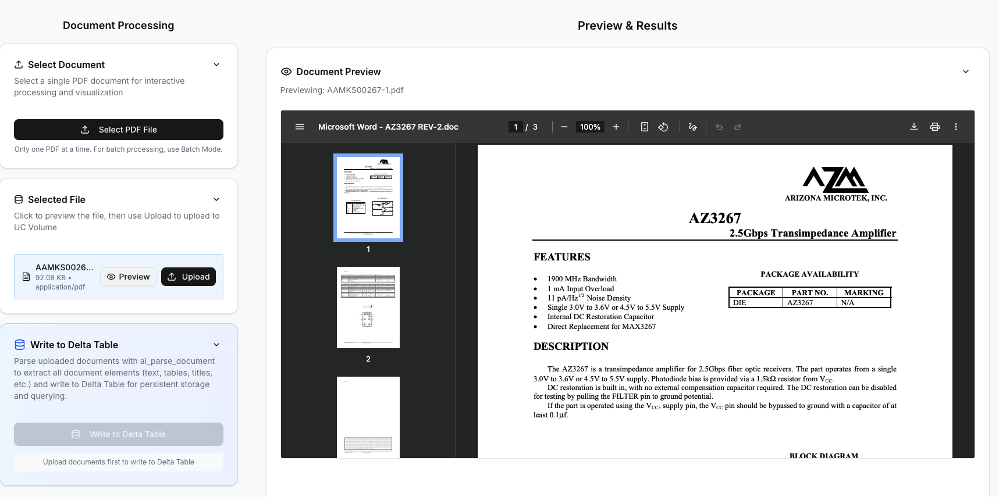
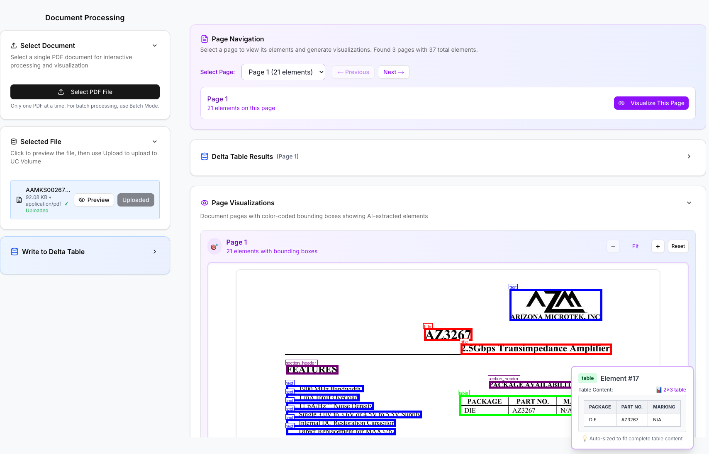
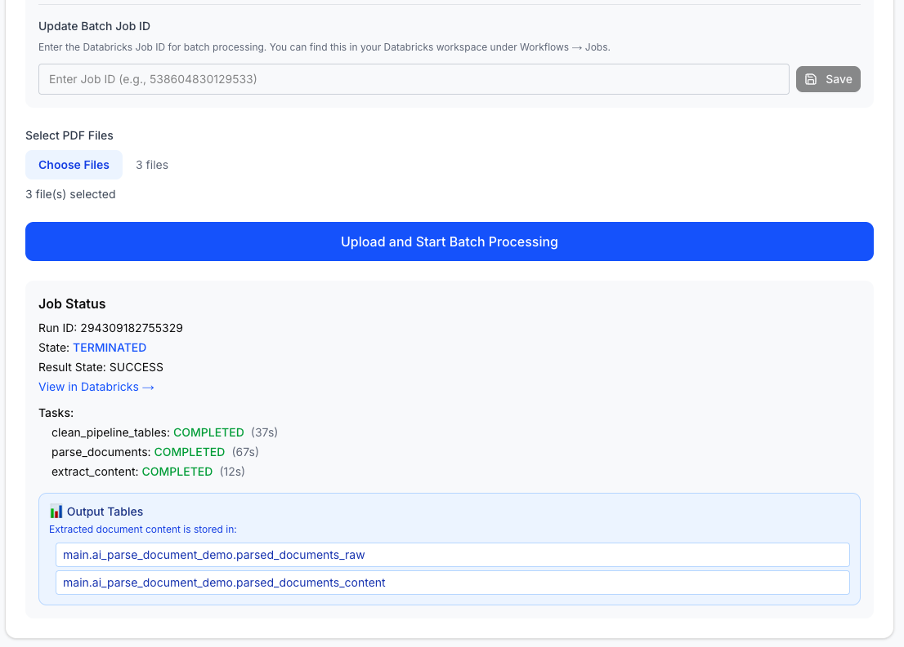
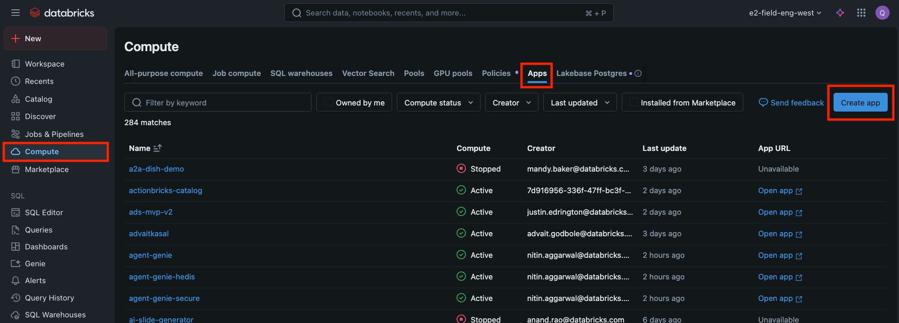
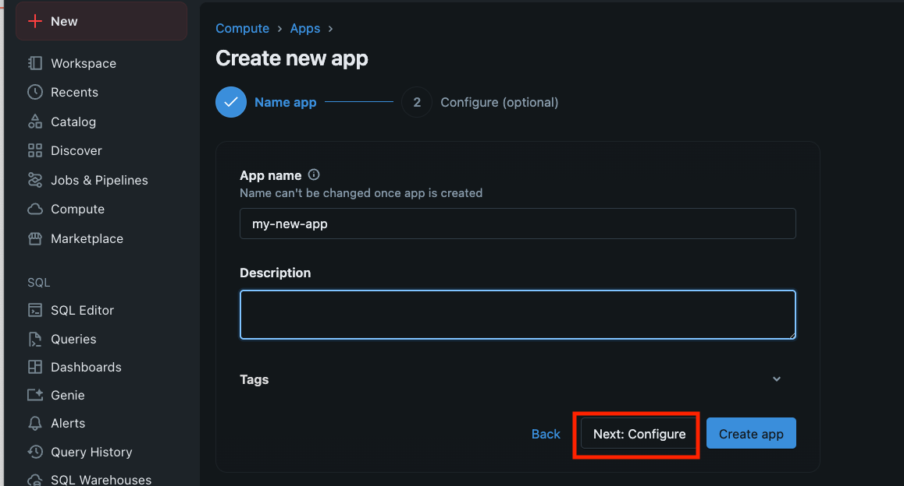
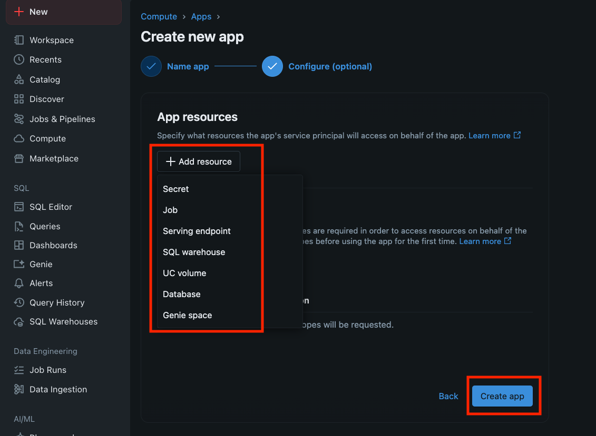
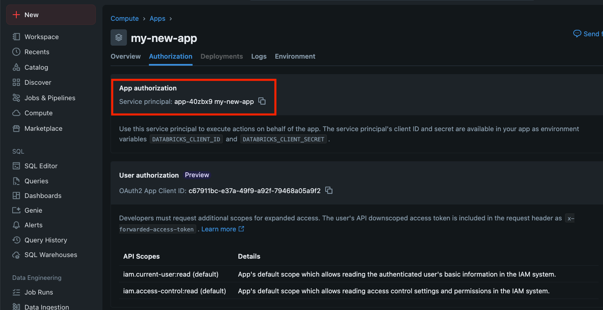

# AI Document Intelligence Demo

A full-stack Databricks application that demonstrates the power of AI Functions for document intelligence, featuring dual processing modes (Interactive and Batch), automated document parsing, structured data extraction, and interactive visualization of detected elements.

---

## 📸 Application Interface

<div align="center">

### 🎯 Mode Selection
Choose between Interactive mode for single-file processing or Batch mode for high-volume workflows



---

### 📄 Interactive Mode - Upload & Configuration
Single-file upload interface 



---

### 🔍 Interactive Mode - Document Visualization
Document processing review with color-coded bounding boxes highlighting extracted elements (text, tables, headers, figures)



---

### 📊 Batch Mode - Job Monitoring
Multi-file processing with live job status tracking, task progress, and output table locations



</div>

---

## 🌟 Key Features

### Dual Processing Modes
- **Interactive Mode**: Single-file processing with real-time visualization and instant feedback
- **Batch Mode**: High-volume processing using Databricks Asset Bundles with Structured Streaming workflows

### Document Processing
- **Upload & Parse**: Drag-and-drop document upload with automatic processing using Databricks AI Functions (`ai_parse_document` v2.0)
- **Multi-Page Support**: Handle complex documents with multiple pages and automatic page detection
- **Structured Data Extraction**: Extract text, tables, headers, and other document elements with bounding box coordinates
- **Delta Table Storage**: Store processed data in Databricks Delta tables for analytics and querying
- **Batch Workflow Integration**: Trigger Databricks Jobs for processing multiple documents with automatic cleanup

### Interactive Visualization
- **Bounding Box Overlay**: Color-coded visualization of detected document elements
- **Zoom Controls**: Interactive zoom functionality for detailed document inspection
- **Page Navigation**: Intuitive page selector with Previous/Next navigation
- **Element Filtering**: View specific types of detected elements (text, tables, headers, etc.)
- **Job Status Tracking**: Real-time monitoring of batch job execution with task-level progress

### Configuration Management
- **Dynamic Configuration**: Real-time configuration of warehouse ID, UC Volume paths, and Delta table paths
- **Batch Job Configuration**: Configure and manage Databricks Job IDs for batch processing
- **Environment Flexibility**: Support for development, staging, and production environments
- **Automatic Detection**: Smart API endpoint detection for Databricks Apps environment

## 📋 Processing Modes

### Interactive Mode
**Best for**: Quick testing, single-document analysis, real-time feedback

- Upload and process **one PDF at a time**
- Immediate visualization with interactive bounding boxes
- Real-time page navigation and element inspection
- Instant results with zoom and pan controls
- Perfect for exploring AI Functions capabilities

### Batch Mode
**Best for**: High-volume processing, production workflows, automated pipelines

- Upload and process **multiple PDFs simultaneously**
- Leverages Databricks Jobs for scalable processing
- Structured Streaming with checkpointing (no reprocessing)
- 2-stage pipeline: document parsing → content extraction
- Real-time job status monitoring with task-level progress
- Automatic cleanup of input directory before each batch
- Results stored in Delta tables for downstream analytics

## 🏗️ Architecture

### Frontend (Next.js 15)
- **Framework**: Next.js with TypeScript and static export for Databricks Apps
- **UI**: Modern responsive design using Tailwind CSS v4 and Radix UI components
- **State Management**: React hooks with comprehensive state tracking
- **API Client**: Robust API communication with fallback URL strategies
- **Mode Selection**: Dynamic UI adapting to Interactive or Batch processing modes

### Backend (FastAPI)
- **API Framework**: FastAPI with automatic OpenAPI documentation
- **Databricks Integration**: Native integration with Databricks SDK and AI Functions
- **Image Processing**: PIL-based visualization generation with color-coded bounding boxes
- **Static Serving**: Serves Next.js frontend while providing API endpoints
- **Job Management**: Databricks Jobs API integration for batch workflow triggering and monitoring

### Data Pipeline

#### Interactive Mode
1. **Document Upload** → UC Volumes via Databricks Files API
2. **AI Processing** → Extract structured data using `ai_parse_document`
3. **Data Storage** → Store results in Delta tables with full schema
4. **Visualization** → Generate interactive bounding box overlays
5. **Query & Display** → Real-time data retrieval and frontend visualization

#### Batch Mode
1. **Workflow Deployment** → Deploy Databricks Asset Bundle to create workflow job
2. **Batch Upload** → Upload multiple PDFs to batch input volume (with automatic cleanup)
3. **Job Trigger** → Start Databricks Job via Jobs API
4. **Streaming Pipeline** → 2-stage checkpointed Structured Streaming workflow
   - **Stage 1**: Parse documents using `ai_parse_document` → `parsed_documents_raw` table
   - **Stage 2**: Extract content from parsed data → `parsed_documents_content` table
5. **Status Monitoring** → Real-time job status and task progress tracking in UI

## 🚀 Quick Start

### Prerequisites

#### For All Modes
- Databricks workspace with AI Functions enabled
- Unity Catalog with:
  - **Catalog** created (e.g., `main`)
  - **Schema** created (e.g., `ai_parse_document_demo`)
  - **Volume** created for file storage (e.g., `ai_parse_document_app_workflow`)
- SQL warehouse for AI Functions execution

#### Additional Prerequisites for Batch Mode
- Databricks CLI installed and configured with profile
- Git repository cloned locally (contains the `unstructured_workflow/` asset bundle)
- Databricks Asset Bundles CLI (`databricks bundle` commands available)

### Local Development

#### Frontend Development
```bash
cd frontend
npm install
npm run dev        # Development server at http://localhost:3000
npm run build      # Build for production
npm run lint       # Code linting
```

#### Backend Development
```bash
cd backend
pip install -r requirements.txt
uvicorn app:app --reload --host 0.0.0.0 --port 8000
```

### Deployment to Databricks Apps

#### 1. Set Up a Databricks App with UI

**Step 1**: Create an empty app with the Databricks app



**Step 2**: Config the app name and resources






For running `ai_parse_document()`, add a SQL Warehouse Resource

**Step 3**: Grant the app service principle the right permission

e.g. Unity Catalog Schema, Volumes



**Note**: One can also use `databricks app create my-app-name` CLI command for app creation

#### 2. Deploy the Databricks App

```bash
# Deploy with default settings
./deploy.sh

# Deploy with custom configuration
./deploy.sh "/custom/workspace/path" "custom-app-name"
```

The deployment script will:
1. Build the frontend with static export
2. Upload static files to your Databricks workspace
3. Package and deploy the backend
4. Configure the Databricks App

#### 3. Deploy the Batch Workflow 

```bash
cd unstructured_workflow

# Deploy the workflow (deploy-only mode, does not run the job)
./run_workflow.sh --profile YOUR_PROFILE

# Deploy and run the job immediately
./run_workflow.sh --run-now --profile YOUR_PROFILE
```

The workflow deployment script will:
1. Validate the Databricks Asset Bundle configuration
2. Deploy the workflow job to your Databricks workspace
3. Display the Job ID for configuration in the app UI
4. Provide instructions for configuring the app

After deployment, configure the Job ID in the app's Batch Mode settings.

## 📡 API Endpoints

### Configuration APIs
- `GET/POST /api/warehouse-config` - Manage SQL warehouse configuration
- `GET/POST /api/volume-path-config` - Configure UC Volume paths (Interactive mode)
- `GET/POST /api/delta-table-path-config` - Set Delta table paths
- `GET/POST /api/batch-job-config` - Configure batch job ID and volume paths

### Document Processing APIs (Interactive Mode)
- `POST /api/upload-to-uc` - Upload documents to UC Volumes
- `POST /api/write-to-delta-table` - Process documents with AI Functions
- `POST /api/query-delta-table` - Query processed document data
- `POST /api/page-metadata` - Get document page information

### Document Processing APIs (Batch Mode)
- `POST /api/upload-batch-pdfs` - Upload multiple PDFs to batch input volume
- `POST /api/clean-batch-input-path` - Clean batch input directory before upload
- `POST /api/trigger-batch-job` - Trigger Databricks Job for batch processing
- `POST /api/batch-job-status/:run_id` - Get job run status and task progress

### Visualization APIs
- `POST /api/visualize-page` - Generate bounding box visualizations

## 📊 Data Schema

Documents are processed and stored with the following schema:

```sql
path: STRING                    -- Document file path
element_id: STRING             -- Unique element identifier  
type: STRING                   -- Element type (text, table, header, etc.)
bbox: ARRAY<DOUBLE>            -- Bounding box coordinates [x1, y1, x2, y2]
page_id: INT                   -- Page number
content: STRING                -- Extracted text content
description: STRING            -- AI-generated element description
image_uri: STRING              -- Associated image URI
```

## 🛠️ Configuration

### Environment Variables
```bash
DATABRICKS_WAREHOUSE_ID=your-warehouse-id
DATABRICKS_VOLUME_PATH=/Volumes/catalog/schema/volume/
DATABRICKS_DELTA_TABLE_PATH=catalog.schema.table_name
NEXT_PUBLIC_API_URL=https://your-databricks-app-url
```

### App Configuration (`backend/app.yaml`)
```yaml
command: ["uvicorn", "app:app", "--host", "0.0.0.0", "--port", "8000"]
runtime: python_3.10
env:
  - name: "DATABRICKS_WAREHOUSE_ID"
    value: "your-warehouse-id"
  - name: "DATABRICKS_VOLUME_PATH" 
    value: "/Volumes/main/default/ai_functions_demo"
  - name: "DATABRICKS_DELTA_TABLE_PATH"
    value: "main.default.ai_functions_demo_documents"
```

## 📁 Project Structure

```
ai_parse_document_databricks_app/
├── frontend/                   # Next.js frontend application
│   ├── src/
│   │   ├── app/               # Next.js App Router pages
│   │   │   ├── document-intelligence/  # Main app page (dual mode)
│   │   │   ├── next-steps/             # Information page
│   │   │   └── page.tsx                # Landing page
│   │   ├── components/        # Reusable UI components
│   │   └── lib/               # Utilities and API configuration
│   ├── package.json
│   └── next.config.ts
├── backend/                   # FastAPI backend application
│   ├── app.py                # Main FastAPI application
│   ├── app.yaml              # Databricks App configuration
│   ├── requirements.txt      # Python dependencies
│   └── image_utils.py        # Image processing utilities
├── unstructured_workflow/    # Databricks Asset Bundle for batch mode
│   ├── databricks.yml        # Bundle configuration
│   ├── resources/            # Job definitions
│   │   └── ai_parse_document_workflow.job.yml
│   ├── src/transformations/  # Databricks notebooks
│   │   ├── 00-clean-pipeline-tables.py
│   │   ├── 01_parse_documents.py
│   │   └── 02_extract_document_content.py
│   ├── run_workflow.sh       # Workflow deployment script
│   ├── CLAUDE.md             # Workflow development guidelines
│   └── README.md             # Workflow documentation
├── deploy.sh                 # App deployment script
├── CLAUDE.md                 # Development guidelines
└── README.md                 # This file
```

## 🔧 Development

### Key Development Patterns
- **Dual Mode Architecture**: Single app supporting both Interactive and Batch processing modes
- **Error Handling**: Comprehensive error handling with user-friendly messages
- **Loading States**: Visual feedback for all async operations (file uploads, job status polling)
- **Responsive Design**: Mobile-friendly interface with adaptive layouts
- **Accessibility**: Proper ARIA labels and keyboard navigation
- **Performance**: Optimized image loading and efficient state management
- **Automatic Cleanup**: Batch mode automatically cleans input directory before each upload

### Code Quality
- TypeScript for type safety
- ESLint for code quality
- Tailwind CSS for consistent styling
- Component composition with Radix UI primitives
- Numeric sorting for page numbers and task ordering

### Batch Workflow Development
- Structured Streaming with checkpointing for incremental processing
- Deploy-only mode by default (jobs triggered via UI)
- Job ID retrieval using `databricks bundle summary`
- Automatic directory and table creation

## 🤝 Contributing

1. Follow the existing code patterns and conventions
2. Test frontend builds before deployment (`npm run build`)
3. Test workflow deployment before committing changes
4. Use the TodoWrite tool for tracking multi-step tasks
5. Ensure proper error handling and loading states
6. Sort data numerically (not as strings) where appropriate
7. Update both CLAUDE.md files when changing architecture

## 🆘 Support

For issues or questions:
1. Check the logs in your Databricks workspace
2. Verify your warehouse, volume, and table configurations
3. Ensure AI Functions are enabled in your workspace
4. Review the deployment script output for any errors

---

**Built with ❤️ using Databricks AI Functions and Databricks App**